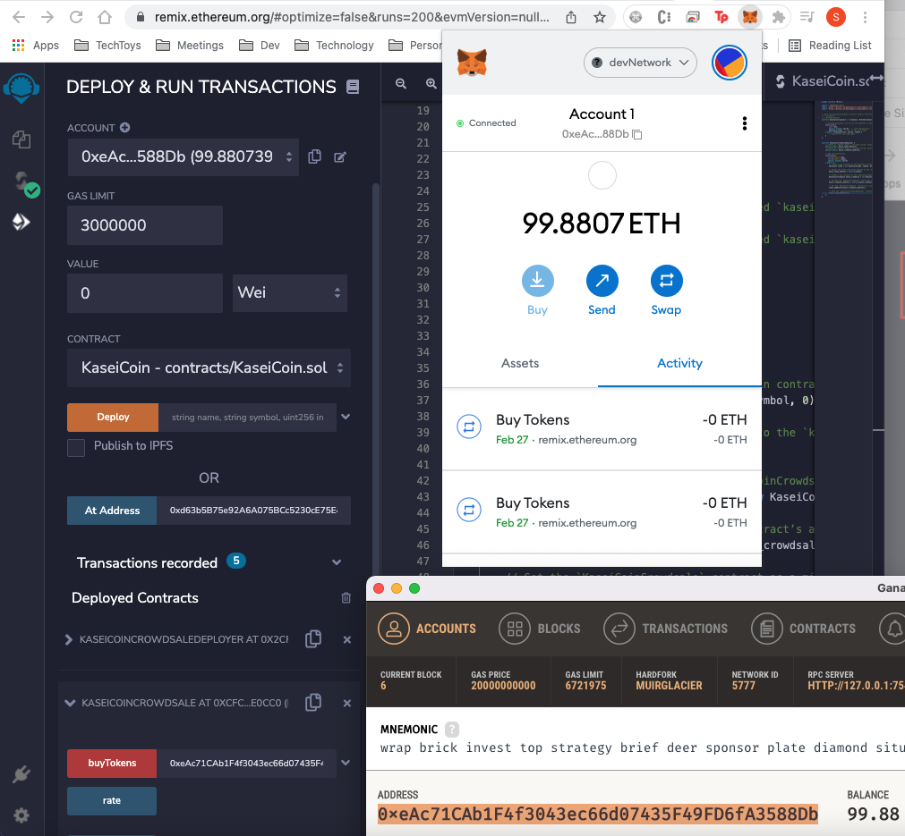

# fungible_token

The following repository is for application to manage the miniting, crowdsale of KaseiCoin, a fungible token that is ERC-20 compliant. The application features also include convertion of fiat money to KaseiCoin


# KaseiCoin Application: new application 

This is a tool that helps in miniting and sales or exchange of KaseiCoin from fiat money. 
 

The current project is the inital design and development of the application to get MVP that can be tested on the current market cycle.

---

## Technologies


*[Jupyter](https://jupyter.org/documentation) - For documentation

*[Blockchain](https://web3py.readthedocs.io/en/stable/overview.html) For Ethereum based blockchain documentation

*[browser based solidity development and testing environment](https://remix.ethereum.org/) Remix IDE

---

## Installation Guide

Before running the application first install the following dependencies.

```python
  pip install jupyterlab  
  pip install web3==5.17
     
    
```
*[Install Ganache](https://www.trufflesuite.com/ganache) - Download and install the Latest Version of Ganache

---

## Usage

[KaseiCoinCrowdsale.sol](https://remix.ethereum.org/) - Please upload the file KaseiCoin.sol and KaseiCrowdsale.sol from github onto Remix IDE under the contracts folder. 


1) Compile the file
2) then deploy the file 


---

## Evaluation Evidence

1) KaseiCoin.sol


2) KaseiCoinCrowdsale.sol


3) Deploying KaseiCoinCrowdsale.sol to local Blockchain

a) same address on Ganash, MetaMask and Remix IDE 


b) beneficiary address on Remix IDE and on Ganash 


c) Transaction confirmation on MetaMask 


d) Transaction balance update on MetaMask, Ganash and Remix 


e) link deployed crowdsale address on Remix IDE 


f) link deployed KaseiCoin address on Remix IDE 


g) Buy  more KaseiCoins 


h) Buy more confirmation in Metamask 


ia) completion of more buy of KaseiCoins 


ib) Total funds raised from crowdsale 


ic) Number of KaseiCoins minted 


ja) Buy more Metamask 


jb) Confirmation of buy in Metamask 


k) Confirmation  in Metamask and Ganash 


l) Transaction list in Ganash 


m) Block list in Ganash 


n) Transaction detail in Ganash 


---

## Contributors

Brought to you by odhissm@gmail.com

---

## License

MIT

